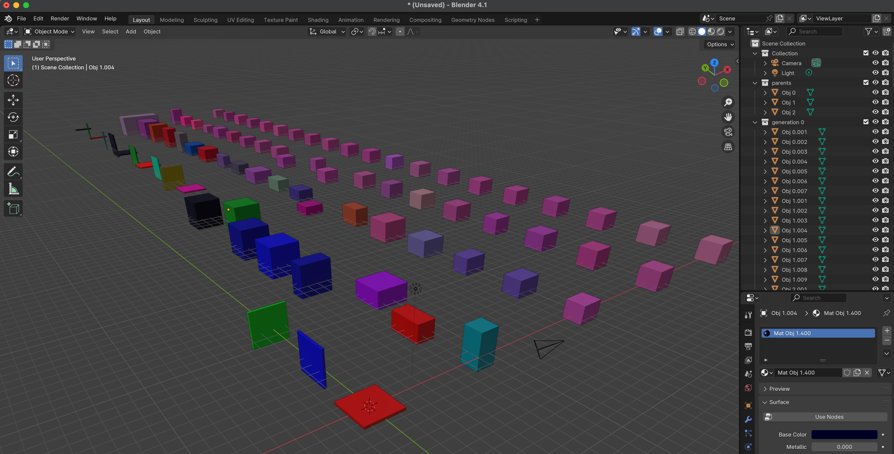
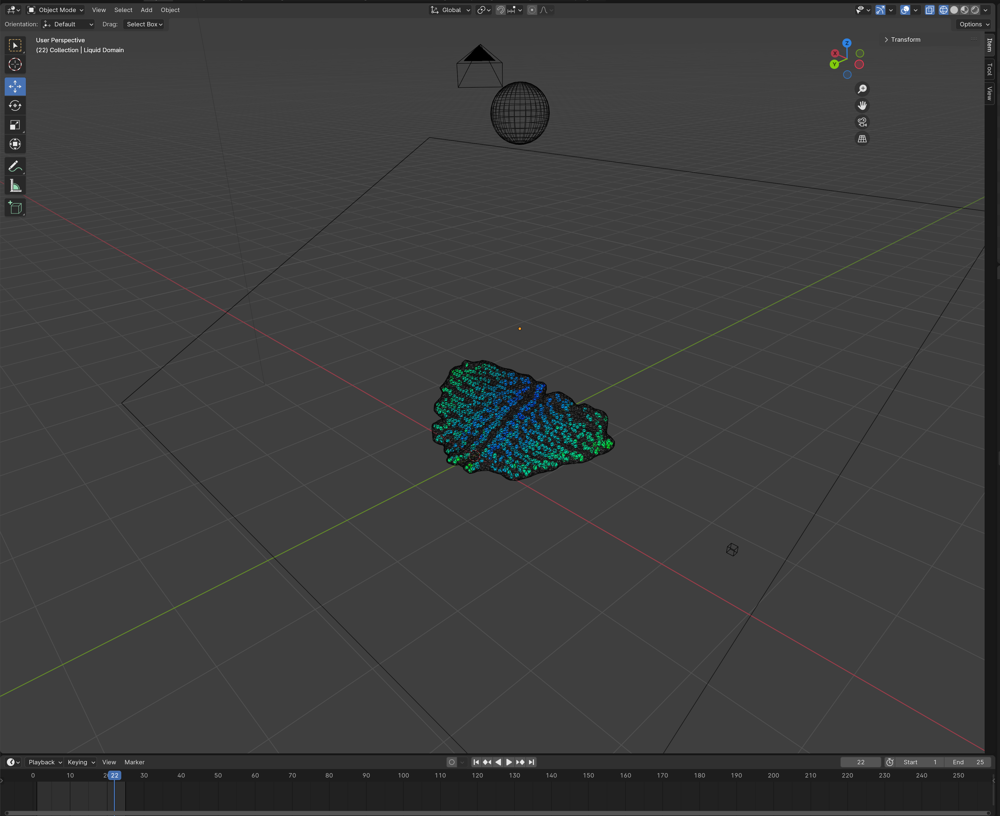
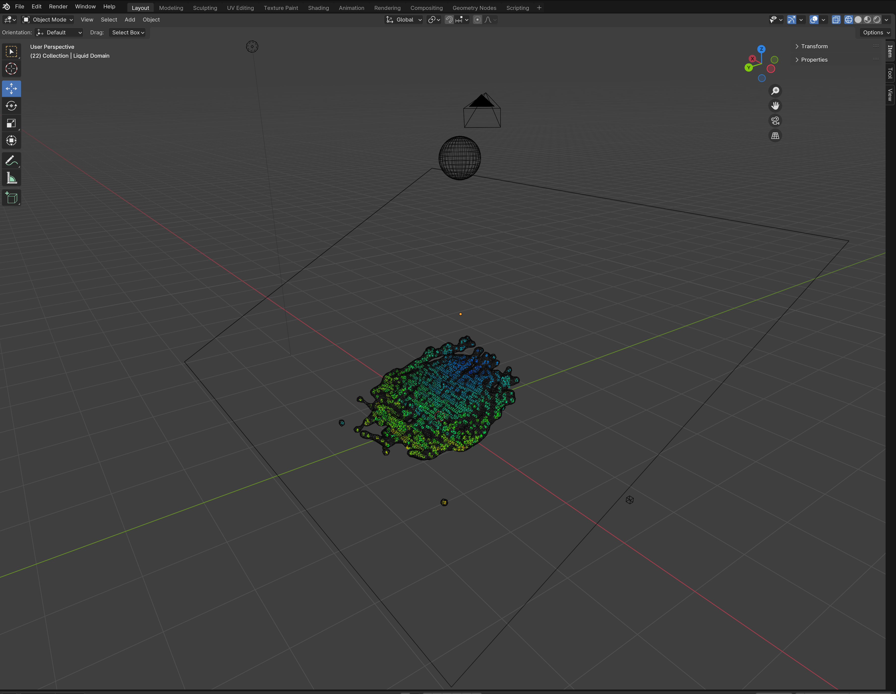

# Genetic Algorithms and Grid Search for Blender Objects

The goal of this project is to learn how to tune complex 3D objects to maximize a fitness value. There are at least two ways to do this: genetic algorithms and grid search. 

## Genetic Algorithms

Genetic algorithms are ways to evolve a set of objects to a final goal. In this case, we wish to evolve Blender objects into something more desireable. In this example, we will try to generate a 2x2x2 mauve cube from three objects: a red plane, a blue plane and a green plane. 

You can see this happen in the picture shown below. The row nearest is the parent generation with three hand created cubes of different dimensions. The next row is the first generation where there is lots of variability. Each row after that gets a little closer to the end goal (a mauve 2x2x2 cube). Finally, to ease understanding of the rows objects to the right side have a higher fitness than objects to the left end of a row. 

Read more [here](doc/GENETICALGO.md)

## Grid Search

The other useful tool is to optimize for a set of parameters using a grid search borrowed from AI & Machine Learning to fine tune hyperparameters. In this case, we may want to modify a set of parameters such as viscocity or FLIP ratio to tune our object. You can open this blender file  [here](data/liquid.blend). 

In this example, we are dropping a liquid on a slanted plane. Our goal is to drop a sphere of liquid that spreads down the plane rather than across it. In the pictures you can see the initial drop as the meshed sphere and inclinded plane as four black lines.

In this first example, the blue green mesh is a liquid drop that is spreading out side (defying physics). 

However, after copying in the code from [grid_search_liquid.py](src/grid_search_liquid.py), running it and optimizing over 14 parameters we get a much more pleasing drop shown below.

and we can also see the steps taken to increase the fitness. This run takes about 7 minutes on a local laptop. 

    Starting...
    INFO:__main__:Initial Fitness = 1.1153738025874727
    INFO:__main__:taking step bpy.data.objects['Liquid Domain'].modifiers["Fluid"].domain_settings.use_fractions = True
    INFO:__main__:	fitness increased to 18.698628635051875
    INFO:__main__:taking step bpy.data.objects['Liquid Domain'].modifiers["Fluid"].domain_settings.cfl_condition = 4.5
    INFO:__main__:	fitness increased to 24.553492684676154
    INFO:__main__:taking step bpy.data.objects['Liquid Domain'].modifiers["Fluid"].domain_settings.resolution_max = 80
    INFO:__main__:	fitness increased to 52.32503882082417
    INFO:__main__:taking step bpy.data.objects['Liquid Domain'].modifiers["Fluid"].domain_settings.flip_ratio = 0.9
    INFO:__main__:	fitness increased to 93.87740790330623
    INFO:__main__:taking step bpy.data.objects['Liquid Domain'].modifiers["Fluid"].domain_settings.use_collision_border_right = True
    INFO:__main__:	fitness increased to 97.70682969104924
    INFO:__main__:There are no more steps that increase fitness
    INFO:__main__:Final Fitness = 97.70682969104924